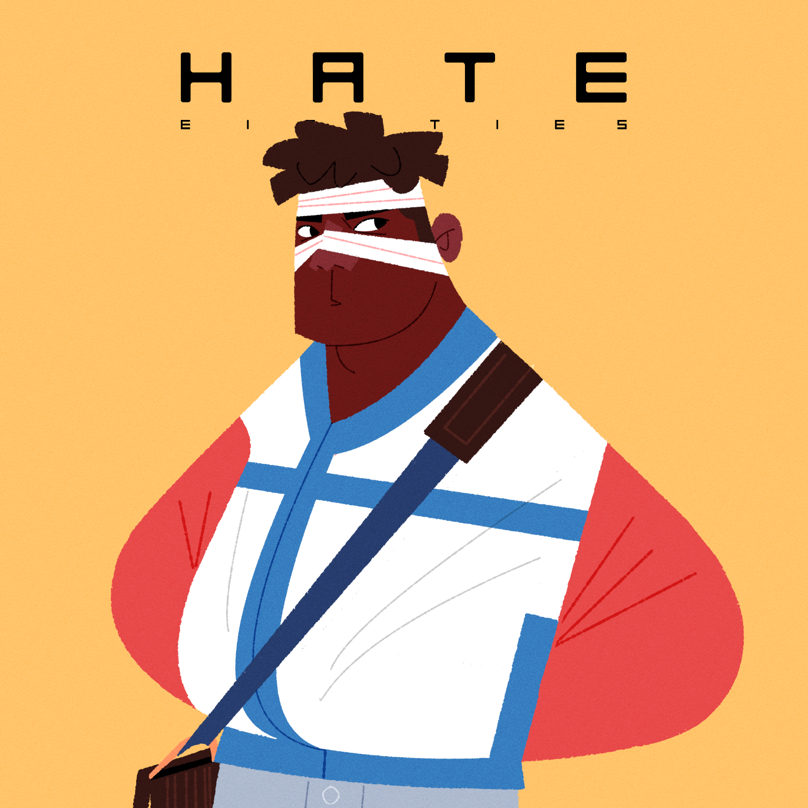




# Instructions

- [ ] Encourage engagement and interaction
- [x] Keep all blog entries as leaf bundles (for example, `hugo new content tech/blog-entry-name` with no .md creates a leaf bundle in the tech section)
- [x] Create a banner image (post-cover.png) in your leaf bundle that has a ratio of 1.85:1, and is no smaller than: 962x520 pixels (Ideally 1536x830 or greater)
- [x] Still manually add banner image into page content, first thing before anything else using the banner shortcode
- [x] Add any other images you use to the images front matter array (this is purely to help with OpenGraph generation)
- [x] You can use up to two more images in the blog entry, but try not to use any more (unless this is a listicle). Only the banner is essential
- [ ] Try to write 1000 words. The closer to this number, the better, but don't go over (75% of the public prefers reading articles under 1,000 words)
- [ ] Reading time should not exceed seven minutes
- [x] Make sure to include a description and summary for the blog entry as these are used on the site and in SEO. Ideally the summary should be short and engaging to entice readers. The description is for webcrawlers and should be around 150 characters (no more than 160)
- [x] Make an appropriate choice of tags in the front matter. These will help in recommending pages to the reader
- [x] Make an appropriate choice of categories in the front matter. The first category will be used in the breadcrumb for the page, others will generate the side menu
- [x] Use Emacs to generate the reading ease and grade level (this should happen automatically when saving the file in my Emacs configuration). These are just for fun, incidentally, and appear to have no impact on audience engagement
- [x] Set the draft to false when you want to publish, then push to GitHub
- [ ] Drop a video announcing this post on Instagram etc, and post anywhere else you can as well. Reels and videos work better for engagement
- [ ] Consider what tomorrow's article will be, and try to post a new one once a day (more is fine)


Ten years is a long time to wait for a band to release their second album, but I've happily done so because that band was The Hate Eighties. When their first album, *[POW](https://thehateeighties.bandcamp.com/album/pow-album)* came out in 2015, I was already primed to love The Hate Eighties because it was formed from past members (Bob Rafferty and Alan Peacock) of another favourite band of mine: El Dog. In fact, one of El Dog's albums---*[Hey Werewolves](https://eldog.bandcamp.com/album/hey-werewolves)*---was my favourite album of 2011, and I still put it on every Halloween.

*POW* was an absolute banger of a concept album, and introduced us to the dystopian alternate reality that The Hate Eighties' music is set in. It wasn't so much an album as a multiple media storytelling playground that also included a musical record of events. I recall fake magazines, websites, movie posters, radio programs, in-character events and online accounts, and who knows what else? It was trippy, experimental awesomeness and I loved every bit of it. If you've not heard *POW*, it's still a wonderful introduction to their world.

However, *[NOW](https://thehateeighties.bandcamp.com/album/now-album)* has somehow upped the game significantly. The world presented in both albums is full of analysis and parody. There's insight and wit, and both records force you to reflect on the same question: what the hell are we doing with the world? But where *POW* was cheeky and irreverent, *NOW* is incisive and biting. Whether The Hate Eighties are presenting an alternative past, a possible future, or a dystopian present; it's clear that they're not messing around any more and want us all to pull our finger out.

You shouldn't enter this album thinking that it's devoid of humour (things are still firmly tongue-in-cheek), but it's also more serious about what it wants you to take away. While you might still smile at the juxtapositions and parody scattered across the tracks, there's an underlying sense of panic and chaos in the rhythmic onslaught: The Hate Eighties are here, and they're not going to let us get away with it anymore. They're just beyond the edge of vision, stalking our minds until we comprehend the horror of what we've done.

While the themes of modern nihilistic malaise and ad-controlled art might be a little dark, the actual music is thoroughly inviting and approachable. I've been singing the songs to myself long after the record stopped playing. Whatever your take on the album's meaning, the songs are a chaotic joy to listen to. The tracks spread themselves across a diverse range of genres (much as *POW* did), but they all work perfectly together. I could listen to *NOW* a million times and still be finding new stuff. It's highly enjoyable on a first listen, and yet has so much complexity that I don't think I'll ever get bored of exploring it.

I doubt I'm intelligent enough to interpret the full meaning of this album, but here is what the tracks said to me:

*Friends* opens the album in full attack mode. The bracing beats and catchy rhythms pull you in immediately. The song is sumptuous, but hits hard. The guitars and drums are pure electro-rock. The content speaks of loneliness in a sea of friends. It makes me think of the illusory nature of fame in a world where clicks are king and real connection is undervalued.

As we get ushered into *Straight To The Heart,* we might be tempted to think that we're approaching a soft landing in which to catch our breath. But no: it's just a ruse. The funky little intro just gets us comfortable before being slammed in the head with the thrashing chorus. It has the sharpest juxtapositions of any single track on the album, and it has no right to work so damn well. To me, it's about the control that companies and billionaires have over our lives, and how they direct us to seek out the wrong things to fulfil ourselves.

*This Song Changes Nothing* is a sneak attack. It's all-the-way-up-to-eleven rock. I've been mumbling the chorus, "death and destruction, baby," to myself for days. The guitar breakdown just after the halfway mark caught me so off guard, and yet is the absolute perfect thing to do here. The sentiment seems like pure nihilism to me: a subtle scolding to us for giving up and not taking a stand.

The intense pulsing bass attack dominating over the reasoned voice-over at the start of *The Animals Can Talk* suggests a metaphor for ad-driven media and corporate interests drowning out the truth of reality from us. While the bass and drum machine beats keep my head banging, the song is also a little terrifying. With the little asides with solo pianos, twisted demon voices, and a freaking brass section... I feel totally discombobulated, yet completely enveloped. It's a giant metaphor for the distractions and attractions that we're presented with in a constant stream every day. And it works. I want to chain myself to the fence so that I get to stay in the sun: who cares what's on the other side?

*In Love With The Devil* opens with 80s synths and tortured screams. The fills are all rising and growing, slowly pushing up until we are overrun. I felt it was talking about hedonism---trading enjoyment for the destruction of the world. And then... out of nowhere... we get a phone call. Is that... is that reality calling? No longer are the lyrics speaking of being in love with the devil: now we are in love with ourselves. Maybe we always were? The dreamy guitars pull us back into the dreamworld once again. Reality is forgotten once more. A bowling ball knocks down the pins. We're not holding back the tide anymore.

Mass control doom scrolling is probably more of an issue than any of us like to admit, and the thumping beats of *New Therapy* on top of the glittering key blasts capture the issue well. It sounds like an attack being committed on someone in the throes of a chemical high, unable to fight back. And yet, the subconscious push back at the end with Bob screaming out, "The structures are falling," shows that the fight is not over and we should still be pushing back. The lyrics are laced with mirror images in each line: not just reflections of our world, but of the double intention of everything presented to us online.

*Stupid* is a catchy little number confronting the closed yes-man loop of the famous, powerful, and deluded. I'm not sure if it's targeting Presidents and billionaires, or social media confirmation bias groupings. Either way, I keep muttering its chorus line to myself when I read the news. I think I probably chuckled at this one more than any song on the album.

As we enter the last act of the album, it feels like things are getting more serious. The Hate Eighties have delivered their thesis statement to us, given their evidence, and now they're here to tie it all together. This song has a slow build up---dripping with tension--- before finally asking how we can be anything other than apathetic under the constant deluge of media immersion and doom horror. *Live Feed (War)* conjures a disconnect between reality and media that keeps us all from taking action. It's agitating, yet leaves a sense of anticipation.

*Zapruder* slows things down a little, giving us a chance to catch our breath and consider the arguments presented to us. It's a darkly epic break. The album's 'long dark night of the soul.' It almost sounds like we might be giving up entirely. Without human connection, does anything we do really matter to anyone but ourselves?

To answer that question, we get *Denounced, Dethroned and Forgotten.* It starts with a cheeky and playful little chord sequence, but then kicks back into a guitar extravaganza. It's the music of someone that's had enough. It's the sound of the marginalised deciding they're going to take it all back. The old world must be cleansed with fire and ash to let the new order rise up. It's a violent call to revolution in the name of art: not to literally hurt anyone, but to tear down and destroy the infrastructure that keeps the status quo in place. The ending quietens to an 8-bit breakdown, and then a simple piano and vocal arrangement with a lament that our lives have been spent trying to get people to look at us for all the wrong reasons.

The album really surprised me with its closing track, *Brothers Break Arms*. This is a sweet and soulful acoustic guitar song, with a simple arrangement, but in the background we hear the sounds of riots and uprising. When all we think and know is manipulated and gamified to the point of fiction, what do we have to lose by just stopping and considering something better? Rather than ending on a bombastic, action-packed takeback of society, we're treated to a thoughtful lament. To me, the song is saying that even if we did manage to take back control, there would still be much sadness and loss and no certainty that our replacement would be any better. But it also seems to be saying that it couldn't be much worse either, so why not try and do it without anger or hate? A call for a considered, emotionless rebellion. It's poignant and a great conclusion to the wild ride the album has taken us on.

*NOW* is a challenging album in many ways. The themes are dark and accusatory. We are scolded for our complicitness in the ills of the world and warned of the overwhelming effort it would take to shake up the status quo. Yet there is hope there. Not just that we might be able to change things for the better, but that we might do it through art and reason, with human connection and caring at the heart of everything. The music sometimes feels like desperate screaming from someone begging us to understand, and at other times it's self-reflective and exasperated. Even with these big swings, the music pushes the boundaries even more by being both playful and serious; switching genres on a dime. The Hate Eighties are trying to use every tool they have to convince us that there is a better world out there if we would just reach out for it together. The album might have ended up being a bleak exercise in intellectualism if the music wasn't so damn good, and the lyrics so funny and insightful. I loved this album on multiple levels: the music is amazing; the lyrics are witty and clever; it made me think and feel; and it gave me hope. It's pretty much what I want all art to be.

[NOW is available to all](https://thehateeighties.bandcamp.com/album/now-album).

