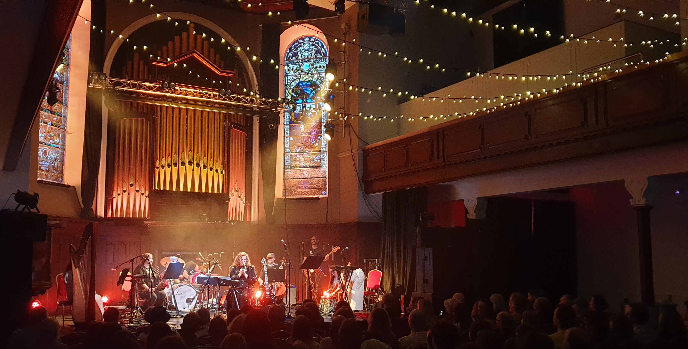




# Instructions

- [ ] Encourage engagement and interaction
- [x] Keep all blog entries as leaf bundles (for example, `hugo new content tech/blog-entry-name` with no .md creates a leaf bundle in the tech section)
- [x] Create a banner image (post-cover.png) in your leaf bundle that has a ratio of 1.85:1, and is no smaller than: 962x520 pixels (Ideally 1536x830 or greater)
- [x] Still manually add banner image into page content, first thing before anything else using the banner shortcode
- [x] Add any other images you use to the images front matter array (this is purely to help with OpenGraph generation)
- [x] You can use up to two more images in the blog entry, but try not to use any more (unless this is a listicle). Only the banner is essential
- [ ] Try to write 1000 words. The closer to this number, the better, but don't go over (75% of the public prefers reading articles under 1,000 words)
- [ ] Reading time should not exceed seven minutes
- [x] Make sure to include a description and summary for the blog entry as these are used on the site and in SEO. Ideally the summary should be short and engaging to entice readers. The description is for webcrawlers and should be around 150 words (no more than 160)
- [x] Make an appropriate choice of tags in the front matter. These will help in recommending pages to the reader
- [x] Make an appropriate choice of categories in the front matter. The first category will be used in the breadcrumb for the page, others will generate the side menu
- [x] Use Emacs to generate the reading ease and grade level (this should happen automatically when saving the file in my Emacs configuration). These are just for fun, incidentally, and appear to have no impact on audience engagement
- [x] Set the draft to false when you want to publish, then push to GitHub
- [ ] Drop a video announcing this post on Instagram etc, and post anywhere else you can as well. Reels and videos work better for engagement
- [ ] Consider what tomorrow's article will be, and try to post a new one once a day (more is fine)


While there are many musicians whose work I truly admire, only one can be my favourite above all. That musician is Jo Mango. This has been the case for over twenty years and I don't see it changing any time soon---certainly not after the masterpiece of an album that she's just released.

It's been a long wait for me (her previous album, *[Murmuration](https://jomango.bandcamp.com/album/murmuration)*, was released fourteen years ago), but in many ways Jo Mango's music has been the soundtrack to my own life: always somehow appearing and speaking to me just as it was most relevant.

The new release, *[The Lightswitch](https://jomango.bandcamp.com/album/the-lightswitch-2)*, is Jo Mango's third LP. It's a concept album centered on the metaphor of a house. Each song plays with the form and meaning that might be discovered in the various items and architectural constructs found inside. But, more than that, it's about the way we project ourselves onto our homes and the things inside. These things take on meanings that may not hold for anyone else because they are a reflection of who we are, or perhaps just who we want to be. The home presented is a place to store emotions, hiding them away to be revisited later. The house lets us turn those emotions on and off as needed: the titular lightswitch.

In much the same way that our homes become a projection of ourselves, we become a reflection of our homes... and on and on the cycle goes. The mental model of these houses may not match reality, but neither does our own self-image.

The songs have the dreamy quality of someone tending to themselves and their loves. At times the songs seem to celebrate the embracing of a passion, and at other times the pain of losing something held dear. But, throughout it all, the hope remains and the will to keep moving forward.

My interpretation of the album is, as always, mine alone. But here is what is said to me:

The album opens with a pulsing anxiety of walls closing in on us. In *The Hall* we are both falling down and picking ourselves up at all times; compartmentalising to make it through. Jo Mango's truly astounding voice takes center stage here, with a minimal accompaniment of keys broken by nervous violin scratches. The music finds a crescendo together with drums and organs to produce a resolve for the journey ahead.

*The Bed* explores a sleepless night where regrets swirl around the mind with an insistence that cannot be shut away without acceptance. Much like *The Hall*, these nerve-tingling fears remain hauntingly beautiful and inviting. While the subject matter might be in the shadows, a light shines to guide us toward brighter possibilities. The slow pulse from *The Hall* has quickened now to one of greater urgency. It reminds me of those nights when I know how important it is that I get some rest, and how increasingly panicked I can feel the longer I fail to fall over.

*The Doorway* suggests that we have finally managed to get to sleep, and in our dreams an ethereal presence has come to pull us out of the hole in which we find ourselves, moving to a better version of ourselves. The lush strings of Adem Ilhan's arrangement come into their own here, seeming to represent the ghostlike presence come to guide us. When I hear this song, though, I don't so much see myself being saved as being given the tools to accept what has happened, and carry it in stronger arms than I had before. Water enters the scene here, and not for the last time on the album: the metaphor of waves for sound giving us music, but also eroding away what we have. Perhaps music itself is the real subject of the album.

The rhythmic pulse returns again in *Your Ear*, but with a calm pace, suggesting comfort has arrived and settled the waters. It may be the album's first song of pure hope, speaking to the importance of things beyond ourselves. It suggests the internal positivity that can come from external influences, and how important those connections can be. The water metaphors make me think that, for Jo Mango, music might be that connection.

*The Window Pane's* irregular heartbeat opening after *Your Ear's* more comforting waves suggests that calmness on the water is always fleeting, and even in the embrace of calm we are always aware of the potential storm on the horizon. Each soft moment is stolen from us: making them harder to enjoy, but easier to appreciate. But there is a defiance at the core of this song: embrace hope and passion, and do not give in to apathy. As Adem's string arrangement spools out and resolves, a darker truth is suggested---perhaps it is only through loss that we can ever truly appreciate what we have. But the power always lies within us to nurture what we love and hold on to what makes us content.

In *Your Heart*, the water imagery is joined by that of a needle on a record. Again, giving us music, but also slowly wearing away the vinyl with each listen. When I hear this beautiful outpouring of dichotomous struggle and delight, it makes me imagine someone wrestling with the joy their passions give them, but the cost of their pursuit wearing them down. Perhaps nothing that is worthwhile is ever truly without cost.

*The Clock* is the only song on the album to be co-written (with Louis Abbott of Admiral Fallow). After falling asleep back in *The Doorway*, it now seems that the alarm clock is trying to pull us back out from our dreams and effortful pursuit of passions. It makes me think of those last moments between the sleeping and waking worlds where we become somewhat aware of the transition, and hear the distant sound of an alarm coming through the fog. Though it's sometimes unwelcome, at other times it saves us. In this case, it seems we are being pulled away against our desires. There are always forces beyond our control that might prevent us from pursuing our passions, and *The Clock* seems to be exploring that, yet being unsure if the best way forward is to fight harder or to accept the loss.

Now awake, *The Typewriter* has us feeling the weight of the day ahead and all we hope to achieve, yet feeling somewhat paralysed about how to proceed. It feels like the outlook is from someone trying to make peace with the loss from *The Clock*. If it is indeed Jo Mango---and music is indeed her passion---it suggests a time when it could not be pursued, but would not cease to exist. I can only imagine such a situation would make the loss all the more painful.

Moving on with our day, we start to be reminded of our passion in all the other things we experience. In *The Pen*, there is a longing. Although the music seems hopeful, it doesn't suggest a resolve to overcome the obstacles hiding our passions. Instead, it's more a desire to return. A small flame, with some loose future plans that maybe, perhaps, will one day come to fruition when the walls blocking us have finally crumbled away.

In *The Compass*, those walls may not have completely shattered, but our eyes might have been opened. No longer are we trying to make peace with the loss, but beginning to accept that our true passions are a part of us and can never be entirely removed from who we are. It is a song of acceptance. Not for what we might have lost, but of who we are.

The effort to regain a passion taken from us by circumstance is no easy thing, and *The Lightswitch* captures that feeling for me. It is the feeling of letting go and reaching out in a constant cycle. Each wave staying a little longer, each release a little shorter, but eventually allowing the light to shine back enough to recapture something that seemed lost. Maya MacAdam's harp performance particularly shines on this one.

As we come to the final track of the album, there is a sense of resolve. In *Your Voice*, it feels like we might have captured that which was lost. Our passion has come back to us, and we have birthed something new with it that satisfies us in a way that little else can. While we may have to put away our emotions in order to preserve ourselves, we can never truly be whole unless we bring them back. The final climbing piano suggests that we have pulled ourselves out of that place we had to go. The place of shelter that was needed in darker times... but was never who we were. Now, we are reborn and can live again in the fullness of who we are.

*The Lightswitch* is truly a beautiful album. I interpreted it as a love letter to music and personal passion and why it's worth fighting for. It has come into my life at a time when I too am trying to recapture my own desire to produce music again. Once more, Jo Mango seems to be the soundtrack to my life. But really, her true gift is that she captures core ideas that speak to all of us. She is a scribe of the human condition that lives within us all. To hear Jo Mango's music is to feel seen and heard. It makes you feel like you belong, and that we all belong together. I dearly hope we don't have to wait another fourteen years for the next album, but if we do, *The Lightswitch* shows us why it will still be worth the wait.

[The Lightswitch is available now](https://jomango.bandcamp.com/album/the-lightswitch-2).
