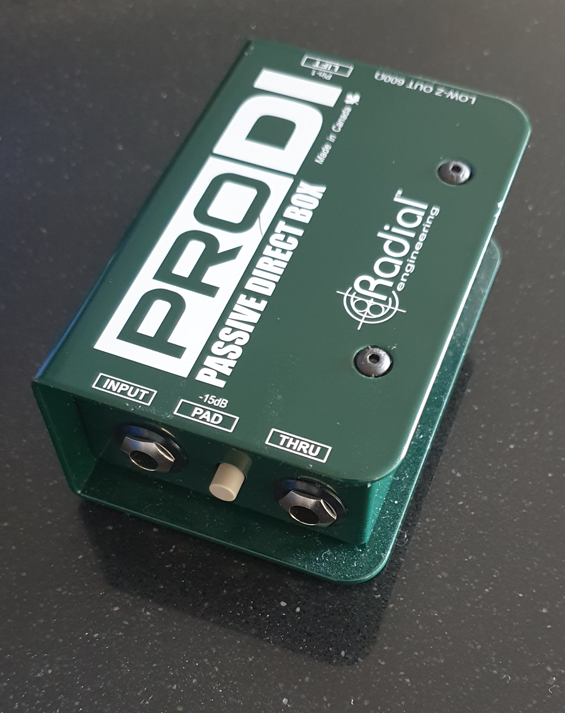




# Instructions

- [ ] Encourage engagement and interaction
- [x] Keep all blog entries as leaf bundles (for example, `hugo new content tech/blog-entry-name` with no .md creates a leaf bundle in the tech section)
- [x] Create a banner image (post-cover.png) in your leaf bundle that has a ratio of 1.85:1, and is no smaller than: 962x520 pixels (Ideally 1536x830 or greater)
- [x] Still manually add banner image into page content, first thing before anything else using the banner shortcode
- [x] Add any other images you use to the images front matter array (this is purely to help with OpenGraph generation)
- [x] You can use up to two more images in the blog entry, but try not to use any more (unless this is a listicle). Only the banner is essential
- [ ] Try to write 1000 words. The closer to this number, the better, but don't go over (75% of the public prefers reading articles under 1,000 words)
- [x] Reading time should not exceed seven minutes
- [x] Make sure to include a description and summary for the blog entry as these are used on the site and in SEO. Ideally the summary should be short and engaging to entice readers. The description is for webcrawlers and should be around 150 characters (no more than 160)
- [x] Make an appropriate choice of tags in the front matter. These will help in recommending pages to the reader
- [x] Make an appropriate choice of categories in the front matter. The first category will be used in the breadcrumb for the page, others will generate the side menu
- [x] Use Emacs to generate the reading ease and grade level (this should happen automatically when saving the file in my Emacs configuration). These are just for fun, incidentally, and appear to have no impact on audience engagement
- [x] Set the draft to false when you want to publish, then push to GitHub
- [ ] Drop a video announcing this post on Instagram etc, and post anywhere else you can as well. Reels and videos work better for engagement
- [ ] Consider what tomorrow's article will be, and try to post a new one once a day (more is fine)


No, I don't mean devices whose privacy you can invade without spending any money. I mean devices you can use for recording that won't cost an arm and a leg.

Hopefully you've followed my recommendation and set up a [dead room](/secrets/setting-up-your-recording-space). With that in place, we need to think about recording equipment. I've found that the most cost-effective solution for high-quality recording is a decent microphone plus a portable recorder that can also function as a computer audio interface.

An audio interface is essential for recording directly into your computer from balanced audio equipment (such as with XLR cables[^xlr-cable]). While this is an important option to keep available, I do most of my microphone recording directly onto a portable recorder. While I could go down the audio interface route (which is far more common), it would mean running long cables throughout my home: the computer would need to be nearby or remotely accessible, and I'd still risk hearing fan noise inside my dead room. This would also make it a little problematic to hit the record button on my computer. To make the most of my dead room, it's easier to have a very quiet recording device that I can keep next to me and operate directly.

I ended up choosing the [Zoom H6](https://zoomcorp.com/en/us/handheld-recorders/handheld-recorders/h6-audio-recorder/) for £199.90 (down from around £290). This allows me to record 4 XLR (balanced) mono signals at the same time, and gives the option to use various plug-in hardware modules (mostly portable microphones). One option is to buy a [Zoom EXH-6 module](https://zoomcorp.com/en/us/accessories/mic-capsules-foot-switches-and-pedals/EXH-6/) to add two more XLR signals to the device (which I did), though four will likely be plenty. The device can also act as an audio interface to my computer, saving me buying a dedicated one for the rare occasions that it will be needed.

The Zoom H6 can operate on batteries or mains power, has user-replaceable storage, and is extremely popular (so much so that it was in production for over ten years before being replaced with the [Zoom H6Studio](https://zoomcorp.com/en/us/handheld-recorders/handheld-recorders/h6studio-new/)). Part of the reason I got the H6 at such a good price was that it was reaching end of life.

One downside is no official support for overdubbing onto a track that was not directly recorded on the device itself (which I absolutely will want to do). However, I figured out a way around this. In essence, you need to 'sacrifice' one of the recording tracks available on the device (or two, if you want stereo) by recording a dummy track onto it, then overwriting that with another file using the same name. If you don't plan to use a module in your current recording session, then the two tracks dedicated to that will do nicely. Additionally, you cannot skip to a particular section of your song to record a part, but will instead need to record for the length of the entire song each time and just come in at the right moment.

I realise this is all technobabble if you don't also have a Zoom portable recorder, but for those that do, here is how to get the highest audio quality when overdubbing a track not recorded on the device:

1. Record onto a channel of the device for slightly longer than the length of the track you want to overdub. If you want this track to be in stereo, you'll need to sacrifice two channels and set them to record as a stereo pair (by holding both selection buttons at the same time).
2. Rename your computer file to match the file you just made on the Zoom H6, then replace the Zoom H6 file with your computer file (it needs to be a WAV file matching the original recording's sample rate and bit depth). **Do not touch any other files** (and particularly not the `hprj` project file).
3. When you then go back to the Zoom H6, the audio should have been replaced, and you can then use the overdub option in the project's settings on the Zoom H6 to do as many takes as needed using the remaining channels.

You could also do a mono mixdown when creating your computer WAV file if you only want to sacrifice one channel on the Zoom H6.

I've found this to be a very good system, but creating the initial sacrificial recording is annoying.

It should be noted that there are many other portable recording devices that offer much the same features as the Zoom H6 (and possibly more) with fewer limitations. However, at the time, the H6 was the one that made the most sense for me (in both price and features) and I have not regretted the purchase one bit.

Another potential downside to this style of recording is that each part is recorded separately. For me, this is no big deal because I tend to record on my own. However, if recording with other people, it can be tricky to keep the audio from bleeding between recordings (as well as fitting everyone into the dead room). As such, I'd advise against recording more than one part at a time.

One other aspect of recording all the parts separately is keeping everything in tune and in time. I would suggest that you decide on the tempo (in BPM) that you want your song to be before you start recording, then stick to that until your song is mastered. This means that you can record to click tracks or metronomes and know that all the parts will line up (the metronome on the Zoom H6 will be audible when recording, but is not captured in the recorded audio). It will also make some software functions and audio plugins easier to use. Additionally, you should make sure your instruments are all tuned to the same pitch before recording, and ideally never record the voice track before other instrumentation. Using a standard tuning where A4 (the A above 'middle C') equals 440 Hz may make it easier to use pitch correction software later in your production.

If sticking to a single BPM throughout the whole song won't work (because some parts are intentionally faster or slower), then I'd advise creating a click track or drum part that incorporates all the tempo changes, then have all the other parts overdub on top of that.

There are a few things to keep in mind about signal sources when recording. Although there are various kinds of microphones (which we'll get into in [another post](/secrets/an-overview-of-microphones)), you generally want to use them with a balanced mono signal cable (such as an XLR cable[^xlr-cable]). These cables shield against electromagnetic interference along the cable's length. These signals will also be low impedance (as is standard for microphone and line-out connections).

Things get a little more complicated when using cables other than XLR, or from a source other than a microphone. Many instruments that have an output cable will use a ¼" mono jack connector (which is unbalanced) and run at a high impedance (as is standard for instrument outputs and line-in connections). Unless you are connecting to a device that explicitly wants to accept an unbalanced ¼" jack connector at a high impedance, you will need to convert the signal to prevent distortion. The standard way of doing this is to use a DI unit (*Direct Input*/*Direct Inject*---a fancy electrical transformer) which will convert the unbalanced, high-impedance ¼" jack signal into a balanced, low-impedance XLR signal. If you keep the cable from the instrument to the DI as short as possible, this will also reduce the level of unwanted noise introduced by electromagnetic fields. Many audio interfaces have some type of DI option built-in to bring the signal down to microphone level, but the Zoom H6 does not. The DI unit I use is the [Radial Pro DI](https://www.radialeng.com/product/prodi), which I purchased for £123.99.

The Radial Pro DI is a passive DI unit that doesn't require a power source. Passive DI units are better suited to high-output instruments (like electric guitars and keyboards). Active DI units are better suited to low-output instruments (like passive pickups on some acoustic guitars, piezo transducers, or systems with long cables). Active DI units require a power source and generally have a built-in preamp.

One final point: don't assume you know what a cable is designed for just because you recognise the connector. For example, a speaker cable and an instrument cable look identical from the outside and share the same type of connector, but internally they are very different and should not be used interchangeably.

Two hundred pounds for a recording box (plus even more for an optional DI) might seem like a lot of money---especially since a standard audio interface with built-in instrument inputs would be cheaper overall. But for the dead room workflow, where you need a quiet, self-contained recorder right next to you, it's the most practical way to make the most of your microphones and isolation setup.

[^xlr-cable]: [Wikipedia page on XLR cables](https://en.wikipedia.org/wiki/XLR_connector).
