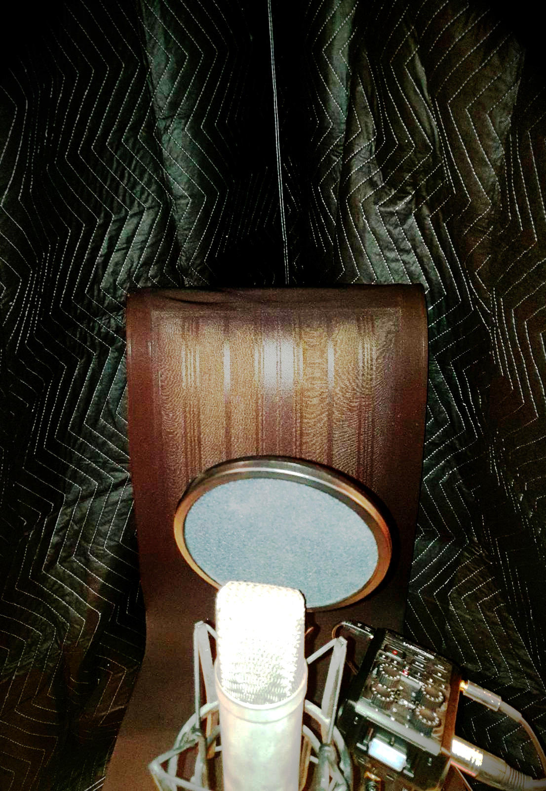
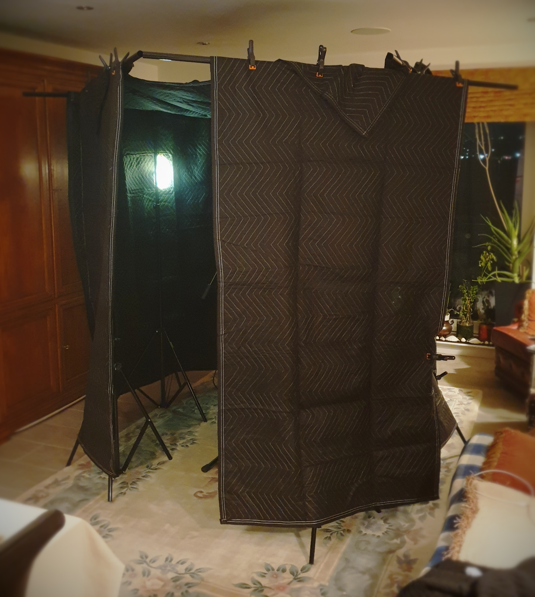




# Instructions

- [ ] Encourage engagement and interaction
- [x] Keep all blog entries as leaf bundles (for example, `hugo new content tech/blog-entry-name` with no .md creates a leaf bundle in the tech section)
- [x] Create a banner image (post-cover.png) in your leaf bundle that has a ratio of 1.85:1, and is no smaller than: 962x520 pixels (Ideally 1536x830 or greater)
- [x] Still manually add banner image into page content, first thing before anything else using the banner shortcode
- [x] Add any other images you use to the images front matter array (this is purely to help with OpenGraph generation)
- [x] You can use up to two more images in the blog entry, but try not to use any more (unless this is a listicle). Only the banner is essential
- [x] Try to write 1000 words. The closer to this number, the better, but don't go over (75% of the public prefers reading articles under 1,000 words)
- [x] Reading time should not exceed seven minutes
- [x] Make sure to include a description and summary for the blog entry as these are used on the site and in SEO. Ideally the summary should be short and engaging to entice readers. The description is for webcrawlers and should be around 150 characters (no more than 160)
- [x] Make an appropriate choice of tags in the front matter. These will help in recommending pages to the reader
- [x] Make an appropriate choice of categories in the front matter. The first category will be used in the breadcrumb for the page, others will generate the side menu
- [x] Use Emacs to generate the reading ease and grade level (this should happen automatically when saving the file in my Emacs configuration). These are just for fun, incidentally, and appear to have no impact on audience engagement
- [x] Set the draft to false when you want to publish, then push to GitHub
- [ ] Drop a video announcing this post on Instagram etc, and post anywhere else you can as well. Reels and videos work better for engagement
- [ ] Consider what tomorrow's article will be, and try to post a new one once a day (more is fine)


So you've written some songs, nailed down the arrangements, and practised till everything's in muscle memory. But how do you record these creative gems when studio time seems so prohibitively expensive?

That's where my band found itself when we first wanted to record music. Thanks to a crappy sound engineer, our one day in a studio was expensive, lacked creative control, and left us with a strong case of impostor syndrome. In response, my brother Jaime and I slowly built up a home recording system instead. It's the system we used on the early *engeo* recordings before we got signed, and it's that same studio setup that I've [recently augmented](/secrets/minimum-requirements/) for modern production.

The requirements for a 'professional' sounding recording setup are simpler than you might expect. And after the initial small investment, the system is essentially free to use forever.

"Surely there is a downside?" I hear you exclaim with incredulity. Well, yes: you'll never match a top studio with top engineers, and the quality you *do* achieve will demand more legwork and skill development on your part. It's best to start with our eyes open because we must make sensible choices about buying equipment and how we use it. And I'm just talking about capturing the audio here, not mixing or mastering. On the upside, I would posit that 95% of your listening audience won't be able to tell the difference if you do it well.

Do keep in mind that the advice on this site is designed for simple recording tasks, like capturing vocals or a single guitar track. If you're planning to record complex instruments like an acoustic drum kit, you'll likely need a more advanced setup. Personally, I use virtual drums and software instruments for anything too difficult to record.

With all that said, let's kick things off with my method for creating a high-quality recording space at home on a budget.

## The Dead Room
There are two approaches to setting up a space for recording 'studio quality' music. The first is to find or create spaces with the exact resonance, echo, and reverb that you want (often *treating* the room with sound-dampening boards or adding extra reflections). The second is to create a space devoid of as much of these things as possible, capturing a perfectly neutral sound (sometimes called a *dead room*). In both cases, the goal is to make sure that only the desired audio is recorded, and all other audio is rejected.

We'll be taking the *dead room* approach for three very practical reasons:

1. It gives us maximal flexibility for what we can do in the computer later.
2. It can be set up easily in most homes and packed away when not needed.
3. It's much cheaper.

There's no wrong approach though. Many recordings from rooms with great character still add reverb and chamber effects in post-production. Conversely, some people find dead rooms too unnatural. I've simply chosen the dead room for the reasons above.

Despite the somewhat ominous name, a dead room is simply a space that minimises audio reflections and reverb. Professional studios have them too, just with more funding. Our solution will maximise the effect while spending the least amount of money by building a room within a room using moving blankets and poster display frames.

I ended up spending £92.27 on nine heavy-duty moving blankets (40" by 72" and quilted in a triangular wave pattern), and £209.94 on six height-adjustable poster stands (5 ft by 8.5 ft, each with four spring clips and a storage bag). I already had a good rug for the floor, but carpet would have worked just as well. Total cost: £302.21. Not exactly super cheap, but also around the same price I was being quoted for one day of recording in a professional studio (and the average song takes three days to record).

The result is a small six-sided room with a roof, made up of moving blankets clipped to poster stands and a rug on the ground---all inside my living room. When you step inside, you immediately notice the reduced echo. This is exactly what we're after.

The downside is that it's dark, hot, and rather ominous. If you're using directional microphones, you can open up one of the corners and point the microphone away from it. Headroom can be tight too, but I generally sit when recording, so it's rarely an issue. If you need to raise the roof by leaving gaps at floor level, the impact on sound quality is minimal. Also remember: when using a cardioid or other unidirectional microphone (see the [overview of microphones](/secrets/an-overview-of-microphones) post), the most important place for absorption material is *behind the audio source*, not behind the microphone. The mic rejects reflections from behind, so you want to dampen reflections coming from the same direction as the sound source.

One last thing: the dead room won't help much with soundproofing. If you can hear a noise before putting it up, you'll still hear it after, and so will your microphone. It prevents echoes and reverberations for a cleaner recording---nothing else. If your home isn't quiet enough for recording, the simplest solution is to pack up the dead room and take it somewhere quieter.

And look at that: we've taken our first practical steps in recording! All we need now is some [microphones](/secrets/an-overview-of-microphones) and a way to [capture the audio](/secrets/recording-devices-on-a-budget)... and then we'll be moving back *[in the box](/secrets/whats-in-the-box)*.
